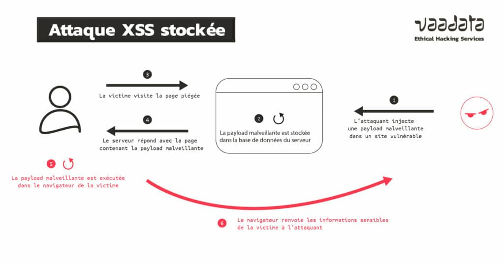

<summary><h1>Documentation-Failles</h1></summary>

<details>
<summary><h1> API Application Programming Interface </h1></summary>
<h2> Qu'est-ce qu'une API ?</h2>
<h2>Application Programming Interface</h2>

- Interface qui permet à deux applications de communiquer
- Pont entre différents systèmes - services
- Échange de données standardisé


- Réutiliser des services existants
- Gagner du temps et éviter de tout recréer
- Connecter plusieurs systèmes (site web, mobile, base de données…)

Exemple concret :
- Votre app météo → API météo → Données actualisées
- Site e-commerce → API banque → Validation paiement 

Points clés :
- Comme un serveur dans un restaurant : vous commandez, il apporte ce que vous demandez
- Omniprésentes aujourd'hui (réseaux sociaux, e-commerce, etc.)  


<h2> API REST REpresentational State Transfer </h2>

Caractéristiques principales :
- Utilise les méthodes HTTP standards
- URLs descriptives et prévisibles
- Format JSON pour les données
- Architecture simple et intuitive

Méthodes HTTP :
- GET /users/123 → Récupérer un utilisateur
- POST /users → Créer un utilisateur
- PUT /users/123 → Modifier un utilisateur
- DELETE /users/123 → Supprimer un utilisateur

Avantages :
- ✅ Simple à comprendre et implémenter
- ✅ Largement adopté et supporté
- ✅ Mise en cache efficace


<h2> API GraphQL Query Language for API </h2>

Caractéristiques principales :
- Une seule URL pour toutes les opérations
- Requêtes flexibles et précises / personnalisation de la requête
- Le client demande exactement ce dont il a besoin

Exemple de requête :
{
    user(id: 123) {
        name
        email
        posts {
            title
        }
    }
}


Avantages :
- ✅ Évite le sur-fetching et sous-fetching
- ✅ Une seule requête pour des données complexes
- ✅ Auto-documentation via le schéma


<h2> REST vs GraphQL </h2>

    Aspect                    REST                     GraphQL 
----------------------- ---------------------- --------------------
    Simplicité 		          ⭐⭐⭐⭐⭐                ⭐⭐⭐ 	     
    Flexibilité                ⭐⭐⭐                 ⭐⭐⭐⭐⭐    
    Performance                ⭐⭐⭐                 ⭐⭐⭐⭐ 
    Apprentissage              Facile               Plus complexe 
    Écosystème                 Mature               En croissance

Quand utiliser REST :
- APIs simples et CRUD basiques
- Équipe débutante
- Mise en cache importante

Quand utiliser GraphQL :
- Applications complexes avec besoins variés
- Applications mobiles (économie de bande passante)
- Équipe expérimentée
</details>

<details>
<summary><h1> CSRF Cross-Site Request Forgery </h1></summary>
<h2> Qu'est-ce que CSRF ?</h2>

Cross-Site Request Forgery est une vulnérabilité qui force un utilisateur authentifié à exécuter des actions non désirées sur une application web.

<h2> Principe fondamental </h2>
Utilisateur connecté + Requête forgée = Action malveillante

Exemple : 
- Comme un escroc utilisant votre signature pour des virements, CSRF utilise votre session web pour agir à votre insu.

<h2> Mécanisme d'une attaque CSRF </h2>


<h2> Conditions pour une attaque réussie </h2>


Pourquoi ça fonctionne ? Les navigateurs incluent automatiquement les cookies dans toutes les requêtes vers un domaine !

<h2>Vecteurs d'attaque CSRF </h2>

- Emails piégés

Objet : "🏍️ Votre moto a gagné !"

De : concours@moto-magazine.com


Cliquez ici pour réclamer vos 500€ d'équipements !

- Réseaux sociaux 

Liens partagés avec descriptions attrayantes

- Attaques AJAX modernes
```bash
// Requête JavaScript malveillante
fetch('https://app.com/api/users/123', {
  method: 'DELETE',
  credentials: 'include' // Cookies inclus !
});
```

- Images malveillantes

```bash
<!-- Image invisible qui exécute l'action -->

```

- Techniques psychologiques
• Urgence : "Offre limitée 5 min !"
• Récompense : Gros gains promis
• Autorité : Faux logos officiels
• Simplicité : "Un simple clic"

<h2> Comment Symfony nous protège </h2>


- Configuration
```bash
# config/packages/framework.yaml
framework:
    csrf_protection:
        enabled: true
        check_header: true
```

- Template Twig
```bash
{{ form_start(form) }}
    {{ form_widget(form.name) }}
    {{ form_widget(form.email) }}
    
    {# Token CSRF automatique ! #}
    
    <button type="submit">Enregistrer</button>
{{ form_end(form) }}
```

- HTML généré
```bash
<form method="POST">
    <input type="text" name="user[name]">
    <input type="email" name="user[email]">
    
    <!-- ✅ Token CSRF automatique -->
    <input type="hidden" name="_csrf_token" 
           value="Vx8rQ2mL9kPnF7sA3hN6bE1tY4uI0wR5">
    
    <button type="submit">Enregistrer</button>
</form>
```
</details>

<details>
<summary><h1> IDOR Insecure Direct Object Reference </h1></summary>
<h2> Qu'est-ce qu'une faille IDOR ?</h2>

Une faille IDOR permet d’accéder à une ressource via un identifiant sans contrôle d’accès.

Exemple :

https://site.com/profil?id=123

➡ Si je remplace 123 par 124 et que j’accède au profil de quelqu’un d’autre → faille IDOR.

<h2> Comment ça marche ? </h2>

- Les objets (comptes, fichiers, commandes) ont un identifiant unique.
- L’application ne vérifie pas si l’utilisateur a le droit d’y accéder.

Exemple :

https://banque.com/compte?id=4501

➡ Si un client change 4501 en 4502 et accède au compte d’un autre → faille.

<h2> Conséquences </h2>

- Accès à des données personnelles (risque RGPD).
- Modification ou suppression de données sensibles.
- Escalade de privilèges (ex. un simple utilisateur accède à des fonctions admin).

<h2> Prévention </h2>

- Ne jamais faire confiance aux paramètres côté client (URL, cookies, formulaires).
- Vérifier systématiquement les droits d’accès.
- Utiliser des identifiants non prévisibles (UUID, tokens).
- Faire des tests de sécurité (pentests, bug bounty).


<h2> Conclusion & OWASP </h2>

- Les IDOR sont simples à exploiter mais aux conséquences graves.
- Elles font partie du Top 10 OWASP 2021 : catégorie #1 – Broken Access Control.

<h2> Message clé : Toujours vérifier qui demande, et à quoi il a droit. </h2>
</details>

<details>
<summary><h1> MITM Man-in-the-Middle </h1></summary>
<h2> Qu'est-ce qu'une attaque MITM ?</h2>

Une attaque Man-in-the-Middle est une cyberattaque où un attaquant
s'interpose secrètement entre deux parties qui communiquent, interceptant
et potentiellement modifiant leurs échanges sans que les victimes s'en
aperçoivent.


<h2> Comment fonctionne une attaque MITM ? </h2>

1. Positionnement
- Wi-Fi public non sécurisé
- ARP Spoofing
- DNS Spoofing
- Compromission de routeur

2. Interception
- Capture de paquets réseau
- Décryptage des communications
- Analyse des métadonnées
- Enregistrement des sessions

3. Manipulation
- Modification des données
- Injection de code malveillant
- Redirection frauduleuse
- Usurpation d'identité

<h2> Types d'attaques MITM </h2>

- Evil Twin
Création d'un faux point d'accès Wi-Fi avec un nom identique à un réseau
légitime pour tromper les utilisateurs.

- ARP Spoofing
Falsification des adresses MAC dans les tables ARP pour rediriger le trafic
vers la machine de l'attaquant.

- SSL Stripping
Rétrogradation des connexions HTTPS vers HTTP pour intercepter les
données en clair.

- DNS Spoofing
Falsification des réponses DNS pour rediriger vers des serveurs malveillants
contrôlés par l'attaquant.

<h2> Risques et conséquences </h2>

<h3>Pour les particuliers</h3>

- Vol d'identifiants : mots de passe, comptes bancaires
- Usurpation d'identité : accès aux réseaux sociaux, emails
- Espionnage : lecture des messages privés, historique
- Fraude financière : transactions détournées

<h3>Pour les entreprises</h3>

- Espionnage industriel : vol de secrets commerciaux
- Compromission des systèmes : accès aux serveurs internes
- Violation de données : exposition d'informations clients
- Perte de réputation : impact sur la confiance

<h2> Risques et conséquences </h2>

- Chiffrement
  - HTTPS obligatoire
  - VPN pour tout le trafic
  - Messagerie chiffrée
  - Protocoles sécurisés

- Vigilance réseau
  - Éviter les Wi-Fi publics
  - Vérifier les certificats SSL
  - Utiliser des réseaux de confiance
  - Surveiller les connexions

- Bonnes pratiques
  - Authentification 2FA
  - Mises à jour régulières
  - DNS sécurisés
  - Formation utilisateurs

- Outils de protection
  - Antivirus avec protection réseau
  - Pare-feu personnels
  - extensions HTTPS
  - Détection ARP Spoofing

<h2> Symfony : Protection côté développement </h2>
<h3>Pourquoi Symfony contre les attaques MITM ?</h3>

Symfony, framework PHP robuste, intègre de nombreuses fonctionnalités de sécurité natives qui aident à protéger les applications web contre les attaques Man-in-the-Middle.

- HTTPS forcé
-  Protection CSRF
- Gestion des sessions
- Headers de sécurité

<h3>Fonctionnalités avancées</h3>

- Validation des données
  - Validation côté serveur obligatoire
  - Sanitisation automatique des inputs
  - Protection contre l'injection SQL

- Authentification robuste
  - Système d'authentification intégré
  - Hashage sécurisé des mots de passe
  - Support OAuth2/JWT

<h3>Bonnes pratiques Symfony contre MITM</h3>

- Toujours utiliser HTTPS en production
- Configurer les headers de sécurité appropriés
- Valider toutes les entrées utilisateur
- Utiliser les bundles de sécurité (SecurityBundle)
- Maintenir Symfony à jour pour les correctifs de sécurité
- Configurer un firewall approprié
</details>

<details>
<summary><h1> MVC Model-View-Controller </h1></summary>
<h2> Qu'est-ce que le MVC ?</h2>

Le MVC (Model-View-Controller) est un pattern architectural 'DESIGN PATTERN' qui sépare une application en 3 parties distinctes :

```
┌──────────────┐
│    MODEL     │  ← Données + Logique métier
└──────────────┘
       ↕
┌──────────────┐
│  CONTROLLER  │  ← Chef d'orchestre
└──────────────┘
       ↕
┌──────────────┐
│     VIEW     │  ← Interface utilisateur
└──────────────┘
```

<h2> MODEL (Modèle) </h2>
<h3>Rôle : Gère les données et la logique métier</h3>

- Accès à la base de données
- Validation des données
- Règles métier
- Ne connaît RIEN de l'interface utilisateur

<h2> VIEW (Vue) </h2>
<h3>Rôle : Affichage et interface utilisateur</h3>

- Pages HTML
- Templates
- Formulaires
- Ne fait QUE afficher
- Ne contient AUCUNE logique métier

<h2> CONTROLLER (Contrôleur) </h2>
<h3>Rôle : Chef d'orchestre entre Model et View</h3>

- Reçoit les requêtes utilisateur
- Appelle le Model pour récupérer/modifier les données
- Choisit la View à afficher
- Passe les données à la View

<h2> FLUX D'EXÉCUTION </h2>

```
1. Utilisateur clique sur "Voir les motos"
         ↓
2. CONTROLLER reçoit la demande
         ↓
3. CONTROLLER demande les données au MODEL
         ↓
4. MODEL récupère les données de la BDD
         ↓
5. CONTROLLER passe les données à la VIEW
         ↓
6. VIEW affiche la page à l'utilisateur
```

<h2> AVANTAGES DU MVC </h2>

<h3>✅ SÉPARATION DES RESPONSABILITÉS</h3>

- Un développeur front : travaille sur les Views
- Un développeur back : travaille sur les Models
- Un chef de projet :  définit les Controllers

<h3>✅ MAINTENANCE FACILE</h3>

- Changer l'interface ? → Modifier seulement les Views
- Changer de base de données ? → Modifier seulement les Models
- Ajouter une fonctionnalité ? → Ajouter un Controller

<h3>✅ RÉUTILISABILITÉ</h3>

- Un Model peut être utilisé par plusieurs Controllers
- Une View peut afficher différents types de données

<h3>✅ TESTABILITÉ</h3>

- Tester la logique métier indépendamment de l'interface
- Tester l'interface indépendamment des données

<h2> ❌ CE QU'IL NE FAUT PAS FAIRE : </h2>

- Mettre du SQL dans une View
- Mettre du HTML dans un Model
- Faire des échos/prints dans un Controller
- Mélanger la logique métier avec l'affichage

<h2> ✅ CE QU'IL FAUT FAIRE : </h2>

- `Model` : Seulement les données et la logique métier
- `View` : Seulement l'affichage
- `Controller` : Seulement la coordination entre les deux

<h2> FRAMEWORKS QUI UTILISENT MVC </h2>

- `PHP` : Laravel, Symfony, CodeIgniter
- `JavaScript` : Angular, Vue.js
- `Python` : Django, Flask
- `Java` : Spring MVC
- `C#` : ASP.NET MVC

<h2> CONCLUSION </h2>

Le MVC n'est PAS compliqué ! C'est juste une façon logique d'organiser son code :

1. `Model` = La cuisine (prépare les données)
2. `View` = La salle de restaurant (présente au client)  
3. `Controller` = Le serveur (fait le lien entre les deux)
</details>


<details>
<summary><h1> ORM Object-Relational Mapping </h1></summary>
<h2> C’est quoi ORM ? </h2>
ORM (Object-Relational Mapping) désigne une technique de programmation informatique qui crée un pont entre les bases de données relationnelles et le paradigme de la programmation orientée objet. L’ORM permet aux développeurs d’interagir avec une base de données à l’aide d’objets, sans avoir à écrire directement des instructions SQL ou à gérer les échanges de données de manière manuelle.

<h2> Exemples d’ORM célèbres </h2>

- Hibernate : un outil ORM très utilisé dans l’écosystème Java.
- Entity Framework : le framework ORM de Microsoft pour .NET.
- Django ORM : intégré dans le framework web Django pour Python.
- ActiveRecord : utilisé en Ruby, notamment avec le framework Rails.
- Sequelize : une solution ORM populaire pour Node.js.

<h2> Définition détaillée </h2>

Dans le développement d’applications, l’accès et la gestion des données jouent un rôle central. Les bases de données traditionnelles fonctionnent avec des tables et des relations, tandis que les langages de programmation modernes utilisent des objets pour modéliser des entités et des comportements. L’ORM offre une couche d’abstraction qui permet de manipuler ces objets et de les persister en base de données comme s’ils étaient des enregistrements de tables.

Grâce à l’ORM, les développeurs n’ont pas besoin de se focaliser sur la complexité des commandes SQL. Ils peuvent rester dans le contexte de leur langage de programmation habituel, en s’appuyant sur des classes et des instances d’objets pour représenter et manipuler leurs données. Un des principaux avantages de cette méthode est qu’elle réduit les erreurs potentielles dans le code SQL, et accélère le développement en permettant la réutilisation du code orienté objet.

<h2> Symfony --> Doctrine </h2>

<h3> Avantage :</h3>

- parler a doctrine dans le langage de doctrine qui se débrouillera pour aller chercher cela dans la base peu importe la configuration de la base de données..
- Il n’y a plus de risque d’injection SQL.
- Si la requête n’a pas possible d’être faite par L’ORM alors il est possible de faire la requête manuellement mais attention risque.
- Rapide, Sécurité, +++.

<h3>Dans un projet Symfony :</h3>

- Une Entity au sens des ORM c’est la représentation sous forme d’objet d’une ligne d’une table. DONC entity = objet. Qui dis objet dis CLASSE.
- Repository, c’est ce que contient les méthodes pour instancier un objet de la table. 

<h3>Pour créer une entity </h3>

```bash
sf make:entity
```
Définissez un objet de la table.
<h3> MIGRATIONS </h3>

Une fois que les entity, repository et autre sont créée
```bash
sf make:migration
```

Création d’un fichier de migration qui sera horodaté.
Ce fichier de migration, quand vous allez lancer la commande migration Symfony, va parcourir toutes les entités et les propriétés et il va tout faire. Donc, on va obtenir un fichier.
Ensuite, il faudra faire
```bash
sf doctrine:migrations:migrate
```
</details>


<details>
<summary><h1> XSS Cross‑Site Scripting  </h1></summary>
<h2> Qu’est-ce qu’une faille XSS ? </h2>

Les XSS font partie de la catégorie des vulnérabilités par injection de code au même titre que les injections SQL. Cependant pour découvrir et exploiter une faille XSS, il s’agit pour un attaquant d’injecter du code malveillant via les paramètres d’entrée côté client.

<h2> Impact potentiel </h2>

- Vol de cookie / token d'authentification (si non HttpOnly ou via JS).
- Usurpation d'identité, actions au nom de l'utilisateur.
- Attaques de phishing, propagation de malware, compromission de comptes.

<h2> Vocabulaire essentiel </h2>

- Payload : le code malveillant injecté 
- Exemple : 

```bash
<script>alert(1)</script>
```

- Escaping (échappement) : transformer des caractères spéciaux pour qu'ils s'affichent ( < → &lt; ), pas d’exécution.
- Sanitization : nettoyage/filtrage du HTML autorisé, enlever balises/attributs dangereux (ex : HTML Purifier).
- CSP : Content Security Policy — règle côté navigateur limitant d'où les scripts peuvent être chargés.
- HttpOnly cookie : cookie non accessible en JavaScript (réduit le vol via XSS).

<h2> I. Attaque XSS reflétée </h2>


<h2> II. Attaque XSS stockée </h2>



<h2> Framework (symphony) vs XSS  </h2>

- Ils fournissent souvent : auto‑escaping dans les moteurs de templates
- {{ post.content }} est échappé automatiquement par Twig 
- const postData = JSON.parse('{{ post|json_encode|e("js") }}’);
json_encode produit une chaîne JSON sûre
|e('js') évite que des séquences brisées écrasent le script.
- Exemple :
```bash
Bundle :
     nelmio/security-bundle

$safeContents = $htmlSanitizer->sanitize($unsafeContents);
```

<h2> Protections essentielles  </h2>

1) Échapper la sortie selon le contexte (htmlspecialchars, attribute, JS, URL).
2) Utiliser le moteur de template (Twig) : auto-escape par défaut — éviter |raw.
3) Ne jamais insérer HTML utilisateur sans sanitizer (ex :  HTMLPurifier($config);).
4) Mettre en place CSP (report-only puis enforcement).
5) Cookies HttpOnly, Secure, SameSite.
