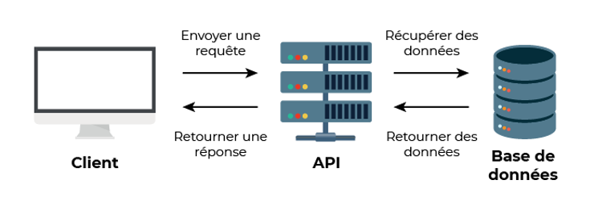
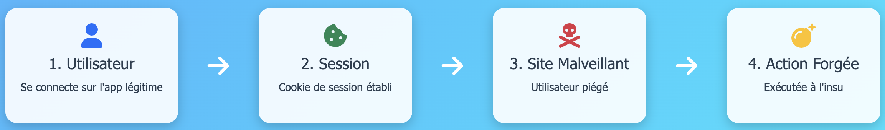
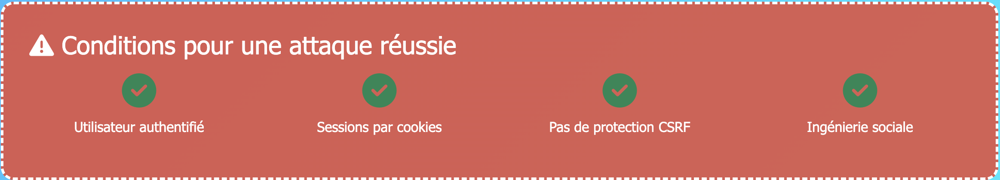
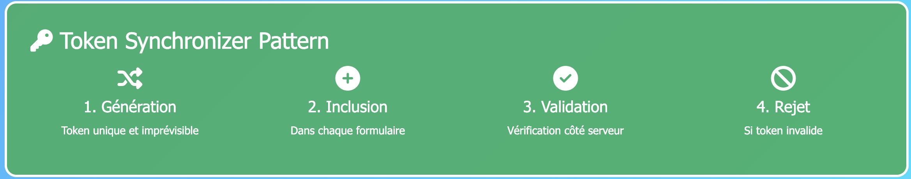

<summary><h1>Documentation-Failles</h1></summary>

<details>
<summary><h1> API Application Programming Interface </h1></summary>
<h2> Qu'est-ce qu'une API ?</h2>
<h2>Application Programming Interface</h2>

- Interface qui permet à deux applications de communiquer
- Pont entre différents systèmes - services
- Échange de données standardisé



- Réutiliser des services existants
- Gagner du temps et éviter de tout recréer
- Connecter plusieurs systèmes (site web, mobile, base de données…)

Exemple concret :
- Votre app météo → API météo → Données actualisées
- Site e-commerce → API banque → Validation paiement 

Points clés :
- Comme un serveur dans un restaurant : vous commandez, il apporte ce que vous demandez
- Omniprésentes aujourd'hui (réseaux sociaux, e-commerce, etc.)  


<h2> API REST REpresentational State Transfer </h2>

Caractéristiques principales :
- Utilise les méthodes HTTP standards
- URLs descriptives et prévisibles
- Format JSON pour les données
- Architecture simple et intuitive

Méthodes HTTP :
- GET /users/123 → Récupérer un utilisateur
- POST /users → Créer un utilisateur
- PUT /users/123 → Modifier un utilisateur
- DELETE /users/123 → Supprimer un utilisateur

Avantages :
- ✅ Simple à comprendre et implémenter
- ✅ Largement adopté et supporté
- ✅ Mise en cache efficace


<h2> API GraphQL Query Language for API </h2>

Caractéristiques principales :
- Une seule URL pour toutes les opérations
- Requêtes flexibles et précises / personnalisation de la requête
- Le client demande exactement ce dont il a besoin

Exemple de requête :
{
    user(id: 123) {
        name
        email
        posts {
            title
        }
    }
}


Avantages :
- ✅ Évite le sur-fetching et sous-fetching
- ✅ Une seule requête pour des données complexes
- ✅ Auto-documentation via le schéma


<h2> REST vs GraphQL </h2>

    Aspect                    REST                     GraphQL 
----------------------- ---------------------- --------------------
    Simplicité 		          ⭐⭐⭐⭐⭐                ⭐⭐⭐ 	     
    Flexibilité                ⭐⭐⭐                 ⭐⭐⭐⭐⭐    
    Performance                ⭐⭐⭐                 ⭐⭐⭐⭐ 
    Apprentissage              Facile               Plus complexe 
    Écosystème                 Mature               En croissance

Quand utiliser REST :
- APIs simples et CRUD basiques
- Équipe débutante
- Mise en cache importante

Quand utiliser GraphQL :
- Applications complexes avec besoins variés
- Applications mobiles (économie de bande passante)
- Équipe expérimentée
</details>

<details>
<summary><h1> CSRF Cross-Site Request Forgery </h1></summary>
<h2> Qu'est-ce que CSRF ?</h2>

Cross-Site Request Forgery est une vulnérabilité qui force un utilisateur authentifié à exécuter des actions non désirées sur une application web.

<h2> Principe fondamental </h2>
Utilisateur connecté + Requête forgée = Action malveillante

Exemple : 
- Comme un escroc utilisant votre signature pour des virements, CSRF utilise votre session web pour agir à votre insu.

<h2> Mécanisme d'une attaque CSRF </h2>



<h2> Conditions pour une attaque réussie </h2>



Pourquoi ça fonctionne ? Les navigateurs incluent automatiquement les cookies dans toutes les requêtes vers un domaine !

<h2>Vecteurs d'attaque CSRF </h2>

- Emails piégés

Objet : "🏍️ Votre moto a gagné !"

De : concours@moto-magazine.com


Cliquez ici pour réclamer vos 500€ d'équipements !

- Réseaux sociaux 

Liens partagés avec descriptions attrayantes

- Attaques AJAX modernes
```bash
// Requête JavaScript malveillante
fetch('https://app.com/api/users/123', {
  method: 'DELETE',
  credentials: 'include' // Cookies inclus !
});
```

- Images malveillantes

```bash
<!-- Image invisible qui exécute l'action -->

```

- Techniques psychologiques
• Urgence : "Offre limitée 5 min !"
• Récompense : Gros gains promis
• Autorité : Faux logos officiels
• Simplicité : "Un simple clic"

<h2> Comment Symfony nous protège </h2>



- Configuration
```bash
# config/packages/framework.yaml
framework:
    csrf_protection:
        enabled: true
        check_header: true
```

- Template Twig
```bash
{{ form_start(form) }}
    {{ form_widget(form.name) }}
    {{ form_widget(form.email) }}
    
    {# Token CSRF automatique ! #}
    
    <button type="submit">Enregistrer</button>
{{ form_end(form) }}
```

- HTML généré
```bash
<form method="POST">
    <input type="text" name="user[name]">
    <input type="email" name="user[email]">
    
    <!-- ✅ Token CSRF automatique -->
    <input type="hidden" name="_csrf_token" 
           value="Vx8rQ2mL9kPnF7sA3hN6bE1tY4uI0wR5">
    
    <button type="submit">Enregistrer</button>
</form>
```
</details>

<details>
<summary><h1> IDOR Insecure Direct Object Reference </h1></summary>
<h2> Qu'est-ce qu'une faille IDOR ?</h2>

Une faille IDOR permet d’accéder à une ressource via un identifiant sans contrôle d’accès.

Exemple :

https://site.com/profil?id=123

➡ Si je remplace 123 par 124 et que j’accède au profil de quelqu’un d’autre → faille IDOR.

<h2> Comment ça marche ? </h2>

- Les objets (comptes, fichiers, commandes) ont un identifiant unique.
- L’application ne vérifie pas si l’utilisateur a le droit d’y accéder.

Exemple :

https://banque.com/compte?id=4501

➡ Si un client change 4501 en 4502 et accède au compte d’un autre → faille.

<h2> Conséquences </h2>

- Accès à des données personnelles (risque RGPD).
- Modification ou suppression de données sensibles.
- Escalade de privilèges (ex. un simple utilisateur accède à des fonctions admin).

<h2> Prévention </h2>

- Ne jamais faire confiance aux paramètres côté client (URL, cookies, formulaires).
- Vérifier systématiquement les droits d’accès.
- Utiliser des identifiants non prévisibles (UUID, tokens).
- Faire des tests de sécurité (pentests, bug bounty).


<h2> Conclusion & OWASP </h2>

- Les IDOR sont simples à exploiter mais aux conséquences graves.
- Elles font partie du Top 10 OWASP 2021 : catégorie #1 – Broken Access Control.

<h2> Message clé : Toujours vérifier qui demande, et à quoi il a droit. </h2>
</details>